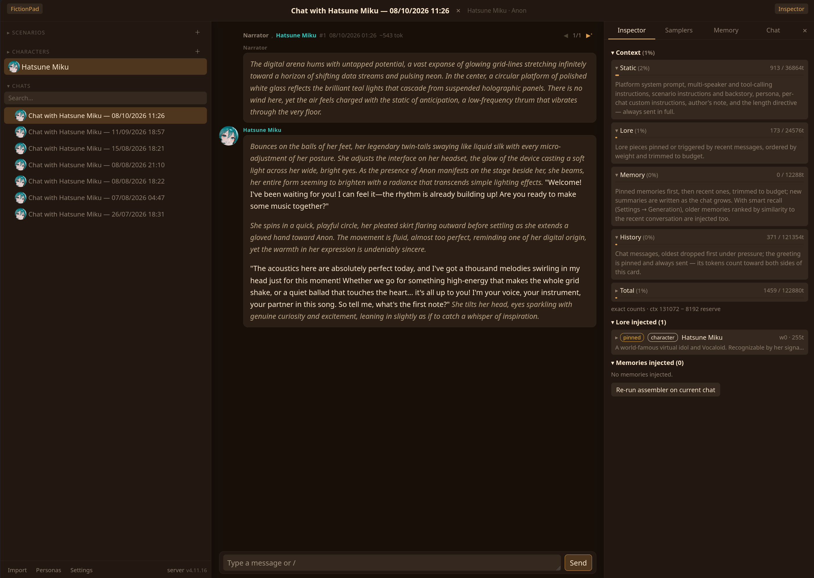

# FictionPad

Yet another single-file frontend, the entire app is one html file with an optional server for remote storage and proxying LLM calls.



Mostly AI readme below.
## Features

- Scenario-centric roleplay: per-scenario prompts, a lorebook with keyword triggers (whole-word / case-sensitive options) and semantic embedding-based activation, per-chat lore overlays, auto-memory, author's note
- Multi-character scenes: name-prefixed multi-speaker replies, global character cards with optional name colours, `/pov` command to rewrite a reply from another character's perspective
- ✦ AI generator: type a prompt and the model drafts the whole scenario, character card, or a single lore piece — optionally fleshing out characters the model registers mid-chat
- Full conversation control: swipes and branching, message editing, drafts, lore templates, full-text chat search, complete export/import, and SillyTavern-style character card import (PNG or JSON)
- Generation introspection: token-probability heatmap with resampling, logit bias editor, sampler controls with per-chat overrides and per-scenario/character defaults, custom user-defined samplers, model reasoning ("thinking") display
- Automatic context limits: detects each model's context length from `/v1/models` (vLLM, llama.cpp, OpenRouter) and sizes the context budget and response reserve to match — manual pinning and per-chat overrides included
- Pseudo Tool calling: the model registers characters and lore mid-reply via built-in tools, story variables, emergent lore generation — plus a cadence-based maintenance pass that reviews the chat's lore and memory notes against the recent story and can propose new pieces, rewrite stale pieces (chat-scoped, branch-safe), and revise memory notes, all through a review queue (or fully automatic)
- Runs fully client-side with IndexedDB persistence; the optional Node server adds LLM proxying and server-side session storage

## Quick start

### Client only

Download `fictionpad.html` from the [latest release](../../releases/latest) and open it in a browser.

### With the server (recommended)

Requires Node.js >= 22.13 (zero dependencies, uses `node:sqlite`).

```sh
node server.mjs          # serves on the default port 8788
node server.mjs 9000     # or pick any port
```

Then open http://localhost:8788 and point the in-app endpoint at the built-in proxy, which forwards to your real LLM server:

```
http://localhost:8788/proxy/http://127.0.0.1:8080
```
Proxying through the server is optional if your backend supports CORS/ACAO.

The server serves the app, optionally proxies LLM calls and stores sessions in SQLite so they sync across browsers.

On first run the server builds the fully self-contained app (`fictionpad.compiled.html`) in the background — the pinned JS dependencies are fetched from esm.sh once, and after that nothing loads from any CDN. Until that build exists (e.g. an offline first run), the repo's dev build is served instead, which needs esm.sh reachable on every page open; the server log says which one it's serving.

### Auth and configuration

All via environment variables:

| Variable | Effect |
| --- | --- |
| `FICTIONPAD_AUTH=user:password` | HTTP Basic auth for the whole server (everything except `/health`). These creds are never forwarded upstream. |
| `FICTIONPAD_TOKEN=secret` | Bearer token required on the storage and `/proxy` routes; set the same value as `serverToken` in the app. |
| `FICTIONPAD_DB=/path/to.db` | SQLite storage path (default: `fictionpad.db` next to `server.mjs`). |
| `FICTIONPAD_PROXY_ALLOW=host1,host2` | Comma-separated allowlist of `/proxy` target hosts (default: any host when auth is configured; loopback-only with no auth). |
| `FICTIONPAD_CHECKPOINT_MS=60000` | WAL checkpoint interval in ms — the on-disk `.db` is always a recent complete snapshot; `GET /backup` (same auth as storage) checkpoints and streams a temp snapshot copy. |
| `FICTIONPAD_UPSTREAM_TIMEOUT_MS=300000` | Total-duration cap in ms per proxied LLM call (streams included) — raise it for very slow backends. |
| `FICTIONPAD_MAX_BODY_MB=64` | Request body cap in MB for storage and `/proxy` — image-heavy chats travel as JSON, so keep it well above a busy chat's size. |
| `FICTIONPAD_AUTOBUILD=0` | Disable the background build of the self-contained app artifact when it's missing (default: build once at startup, never blocking). |

Example, basic auth on a custom port:

```sh
FICTIONPAD_AUTH=me:hunter2 node server.mjs 9000
```

Safety note: with no auth configured, `/proxy` only forwards to loopback targets, so an exposed unauthenticated server is not an open relay. Still, put `FICTIONPAD_AUTH` on anything reachable from the network.

## Building from source

The app ships as one HTML file, but the source is split for maintainability:

- `template.html` plus `src/` (`styles.css` and numbered JS modules, concatenated in the order listed in `vendor.mjs`; shared scope, order matters)
- `node vendor.mjs` regenerates `fictionpad.html` and `fictionpad.compiled.html`. Dependencies (React 19, htm, marked) are pinned, fetched from esm.sh, SHA-256 verified, and inlined as `data:` URL importmap entries, so the compiled artifact has no runtime CDN dependency
- `node vendor.mjs --check` fails if the generated artifacts are stale
- Tests: `node tests/assembler.test.mjs` and `node tests/server.test.mjs`


## Credits and Licensing

This project was written entirely by Kimi K3 High, there is no license, do as you please.
